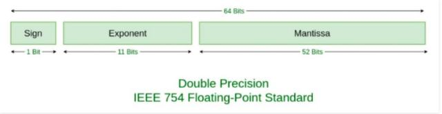

## 为什么0.1+0.2 != 0.3

在JavaScript中，处理浮点数符合IEEE754双精度标准。也就是说一个浮点数将以下面的方式保存对应的浮点数类型的数字:



在计算机底层数字的存储形式为二进制，浮点数进行保存的时候，一些数字会存在舍入误差。在JavaScript中进行如下计算我们可以得到下面的结果

```js
a = 0.1
b = 0.2
console.log(a + b )
// 0.30000000000000004
```

计算机在对a和b两个浮点型的数字进行保存的时候，会使用二进制形式，但是由于a,b不能被二进制有限表示，故会存在一定的舍入误差，使得实际上保存的二进制数字并不是精确的a,b的值，在进行计算的时候并不为0.3


考虑到计算机存储二进制的局限性，我们可以设置一个限度，如果两个值的小于我们设置的这个限度，我们就可以认为这两个数是相等的，比如

```js
isEqual = Math.abs(a-b)<Number.EPSILON
```