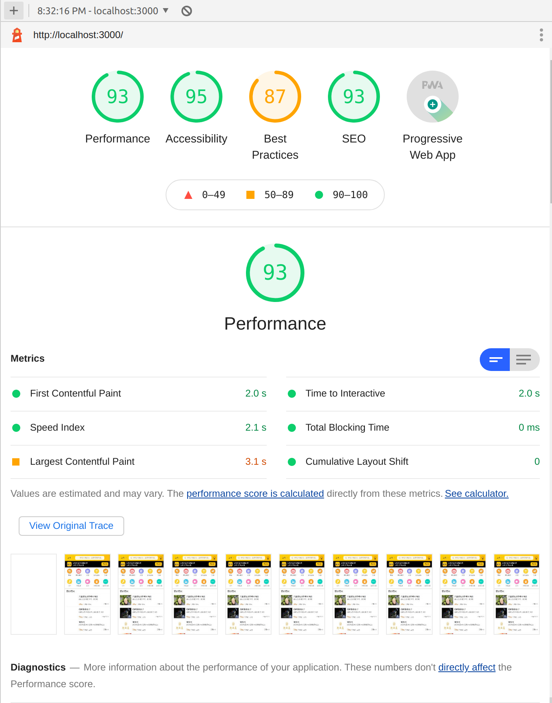
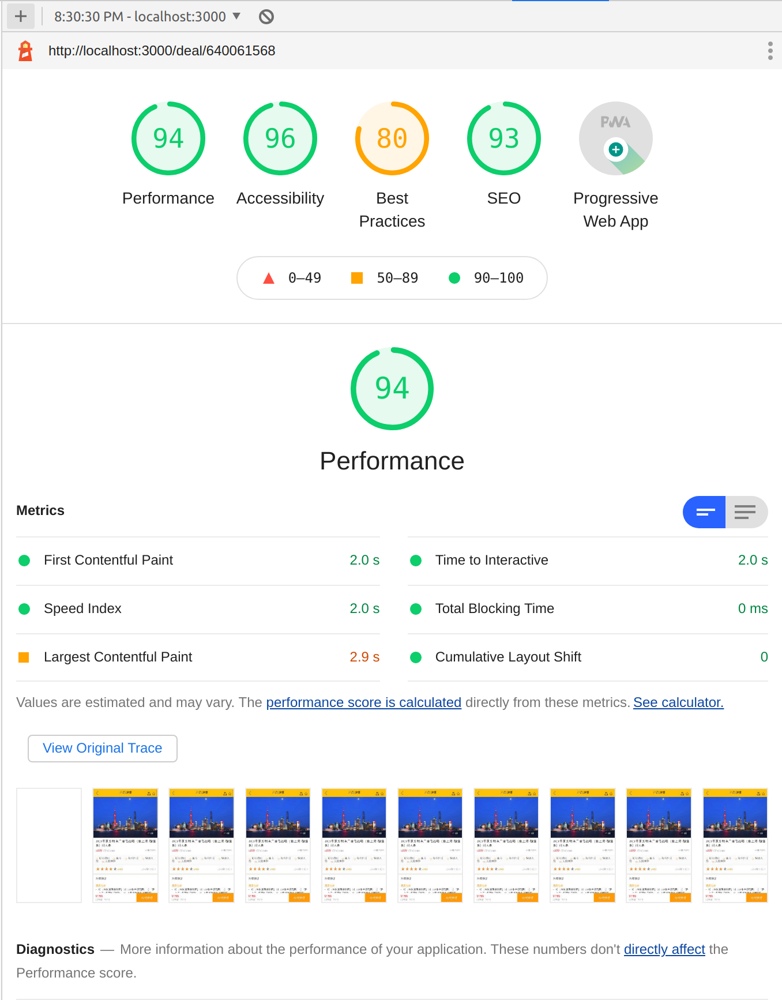

## 简介
该项目主要模拟美团APP手机端网页版首页，由于美团产品详情数据对应的`api`有多个，这里仅仅实现其中的某一类，项目中可以正常访问某些产品的详细信息页

## 运行
```bash
# 本项目提供 docker-compose.yml 进行构建
# 在对应的目录下执行下面的命令即可
docker-compose build && docker-compose up
```
## 技术方案
- 前端
    - `Nextjs`
- 后端
    - `Golang`
        - `Gin`
- 部署
    - `Docker`

## 支持功能
- PWA
    - 使用`next-pwa`
- SSR
    - 使用`Nextjs`进行服务端渲染

## 展示
#### 首页
> 访问 http://localhost:3000


#### 详情页
> 访问 http://localhost:3000/deal/640061568


## 性能测试
> 每一次性能测试都可能不太一样，这里给出某次测试结果

### 首页测试结果


### 详情页测试结果

